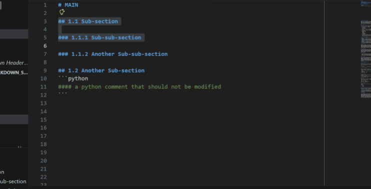

# Markdown Header Promote / Demote

A VS Code extension that lets you **promote** and **demote** markdown headers while preserving the relative structure of all sub-sections.

It now uses document structure instead of regexes to find headers, inspired by [adjust-heading-level](https://github.com/fake-monkey/adjust-heading-level/blob/main/src/utils.ts). This makes it more robust and allows it to handle edge cases like headers inside code blocks or lists.

## Demo



## Features

| Action      | Keybinding  | Effect                                    |
| ----------- | ----------- | ------                                    |
| **Demote**  | `Tab`       | Increase header level (e.g. `##` → `###`) |
| **Promote** | `Shift+Tab` | Decrease header level (e.g. `###` → `##`) |

> **Note:** These keybindings only activate when the cursor is on a markdown header line (`# ...`).  Normal `Tab` indentation works everywhere else.


### Structure-preserving

When your cursor is on a header line *without* a selection, **the entire section** (the header and every sub-header beneath it, up to the next sibling or higher-level header) is promoted or demoted together.  The relative depth of sub-sections is kept intact.

```markdown
## Chapter 1          →  ### Chapter 1
### Section 1.1       →  #### Section 1.1
#### Detail           →  ##### Detail
### Section 1.2       →  #### Section 1.2
## Chapter 2               (unchanged — outside the section)
```

### Selection-aware

If you **select** a region of text first, only the headers inside that selection are adjusted.  This lets you surgically promote or demote any part of the document.

### Automatic numbering

If your headers use numeric prefixes (e.g. `1.1`, `1.2.3`), the extension automatically recalculates **all** numbered prefixes across the entire document after every promote/demote operation.  This keeps numbers consistent even for headers outside the selected block.

```markdown
Before (demote "1.2 Advantages"):

# 1 Introduction
## 1.1 Basic Syntax
## 1.2 Advantages        ← demote this section
### 1.2.1 Speed
## 1.3 Conclusion

After:

# 1 Introduction
## 1.1 Basic Syntax
### 1.2.1 Advantages     ← now a sub-section of 1.1
#### 1.2.1.1 Speed       ← child renumbered too
## 1.2 Conclusion        ← was 1.3, renumbered to 1.2
```

This behaviour can be turned off in settings (see below).

If you need a literal number in a header that shouldn't be updated, you can add an empty comment `<!-- -->` before the number.

```markdown
## <!-- -->1 Country, 2 Languages   ← this '1' will not be updated by the auto-numbering
```

### Safety

- Headers will never be promoted past `#` (level 1) or demoted past `######` (level 6).
- A warning is shown if the operation would violate those bounds.

## Installation (from GitHub)

Since this extension is not published on the VS Code Marketplace, you can install it directly from the repository by building a `.vsix` package.

### Prerequisites

- [Node.js](https://nodejs.org/) (v16 or later)
- [Git](https://git-scm.com/)
- The **vsce** CLI (`npm install -g @vscode/vsce`)

### Steps

1. **Clone the repository**

   ```bash
   git clone https://github.com/<your-username>/vscode_extension_markdown_structure.git
   cd vscode_extension_markdown_structure
   ```

2. **Build and install to VS Code**

   ```bash
   npm run add_to_vscode
   ```

   This runs the `preadd_to_vscode` script to install dependencies and compile the source, then packages the extension and installs it in VS Code.

## Usage

1. Open a Markdown file.
2. Place your cursor on a header line, or select a range of lines.
3. Press `Tab` to **demote** or `Shift+Tab` to **promote** (only active when the cursor is on a header line).

## Commands

The extension also exposes two commands in the Command Palette:

- **Markdown: Promote Headers**
- **Markdown: Demote Headers**

## Configuration

| Setting                             | Type      | Default | Description |
| ----------------------------------- | --------- | ------- | ----------- |
| `markdownStructure.updateNumbering` | `boolean` | `true`  | Automatically update numeric heading prefixes across the entire document after promoting or demoting. |

To change this setting, open **Settings** (`Ctrl+,` / `Cmd+,`) and search for `markdownStructure`.

## License

MIT
